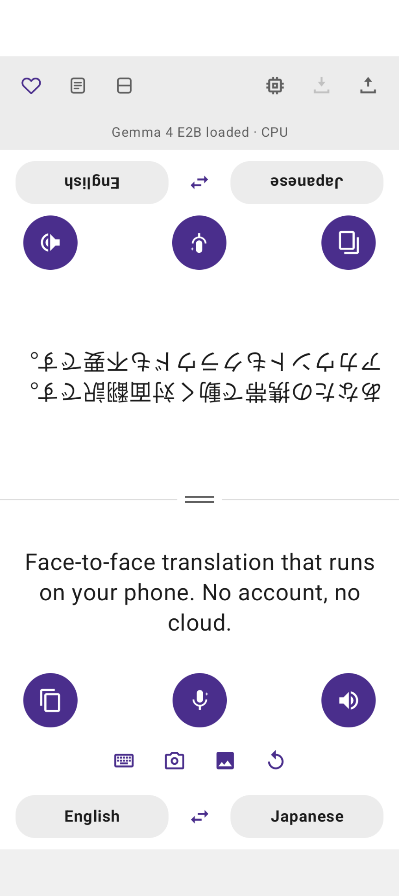
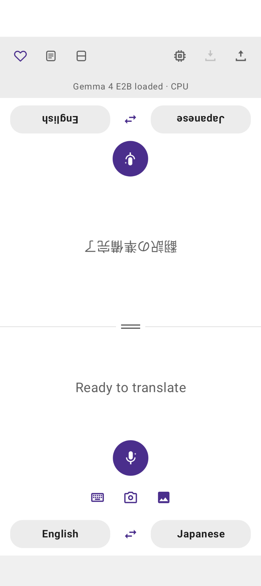

# Aire Offline Translate

A face-to-face conversation translator for Android that runs **entirely on the device**. Speech
recognition, translation and speech synthesis all happen locally — after the model is downloaded,
no text, audio or image ever leaves the phone.

Translation runs on **Gemma 4** via Google's LiteRT-LM runtime.

<p align="center">
  
  &nbsp;&nbsp;
  
</p>

<p align="center"><em>The phone lies flat between two people. The far half is rotated 180° so it
reads the right way up from the other side of the table — each person taps their own microphone and
reads their own language.</em></p>

---

## 🙋 Testers wanted

The app is in **closed testing on Google Play** and needs volunteers before it can be released
publicly. Google requires twelve testers, so a handful of people genuinely makes the difference
between this shipping and not.

**Email [jasonlim1912@gmail.com](mailto:jasonlim1912@gmail.com)** with the Google account address
you use on the Play Store — that exact address is what the invitation is tied to, so a different
one will not work.

You will get back an opt-in link. Open it on your phone, tap **Become a tester**, then install from
Play as normal.

Before volunteering, check your phone can actually run it:

| | |
|---|---|
| **Android** | 13 or newer |
| **RAM** | 6 GB or more — the model holds ~2.6 GB while loaded |
| **Storage** | 2.6 GB free, downloaded over Wi-Fi on first use |

There is nothing to pay and nothing to sign up for. What is genuinely useful is running one real
conversation in a language pair you know and saying whether the translation was usable — including
if it was not. Bug reports are welcome as
[issues](../../issues), and so is "this worked fine".

Testing runs for two weeks, and you can leave at any time from the same opt-in link.

---

## What it does

The screen is split into two halves, the upper one rotated 180° so it faces the person across the
table. Each half shows its own language and has its own microphone, replay and copy controls.

- **Speak** — tap the microphone, speak, tap stop. The transcript appears on the speaker's half,
  the translation on the listener's, and is read aloud in the listener's language.
- **Type** — a keyboard button on the lower half for text input.
- **Camera** — point it at a sign or a menu, drag the box (or its corners) over the text you want,
  then tap Start. Only what is inside the box reaches the model. Start arms the shot rather than
  taking it outright: the app waits for the phone to settle first, which absorbs the wobble of the
  tap itself. It reads one frame rather than continuously, because a vision encode plus a
  translation takes seconds.
- **Photo** — pick an image from the gallery instead. Both routes use the model's own vision
  encoder, so every script the model knows is covered.
- **Replay / copy** — per half, so either person can hear a line again or copy it. Copy is a
  button rather than text selection because the platform's selection UI does not respect the
  rotated half.
- **New session** — a restart button appears beside the input controls once a turn has finished,
  and clears both halves. It leaves the languages, split position and panel rotation alone: those
  are deliberate choices, and wiping them would make "new session" mean "undo my setup".
- **Cancel** — the microphone becomes a red stop square while recording, and a red cross while
  speaking, which abandons the run.
- **Blocking dialogs** — model loading and translating each take over the screen while they run,
  both with their own cancel. Nothing else the app offers works until they finish, so leaving the
  rest of the UI live only ever produced taps that queued up behind the turn already in progress.
  Recording is not one of them: the microphone button itself becomes the stop button.

18 languages: English, Arabic, Chinese (Simplified and Traditional), Filipino, French, German,
Hebrew, Hindi, Japanese, Korean, Malay, Russian, Spanish, Tamil, Thai, Turkish, Vietnamese.

The UI itself is localised into English, Chinese (Simplified), Japanese, Spanish and Arabic, and
follows the phone's language setting.

---

## Device requirements

This is a demanding app. A multi-billion-parameter model running locally is not free.

| | |
|---|---|
| **Android** | 13 (API 33) or newer |
| **CPU** | `arm64-v8a`. 32-bit ARM is **not supported** — LiteRT-LM ships no `armeabi-v7a` binary |
| **RAM** | 6 GB or more. The engine holds roughly 2.6 GB resident while loaded |
| **Storage** | 2.6 GB for the model, plus headroom during download |
| **Services** | Google speech recognition and text-to-speech, with language packs installed for the languages you use |

### Accelerator support

Which backend works is only knowable at runtime, so the app tries them in order and keeps the
first that can actually execute a kernel:

1. `GOOGLE_TENSOR` — Pixel devices
2. `GPU` — Snapdragon, MediaTek and anything else exposing OpenCL
3. `CPU` — works everywhere, but time-to-first-token is measured in seconds

**Pixel devices have no OpenCL driver**, so the GPU backend fails there with "Can not find OpenCL
library on this device" — hence the Tensor-specific path being tried first on that hardware.

The download dialog closes itself the moment the weights land, and stays open with the reason and a
retry when a download fails.

There is no demo or fallback engine. Until the weights are downloaded, anything that would need
them — speaking, typing, the camera, the gallery — raises a prompt offering the download instead of
starting. An engine that answers with invented translations is indistinguishable from a working one
to whoever is reading the screen, which makes it worse than none at all.

The model loads by itself: at launch when the weights are already on the device, and as soon as a
first download finishes. It is released again after five minutes in the background, when Android
reports real memory pressure, or when you tap unload. Holding ~2.6 GB makes this process the most
attractive thing on the phone to kill, so giving it back on request is what keeps the app — and the
conversation on screen — alive.

Loading is validated by running a real one-token generation, not just `initialize()`, because
LiteRT-LM defers kernel compilation and a backend that cannot run will still initialise cleanly.

---

## Models

Nothing is bundled — the model is 2.59 GB, far past Google Play's limits. It is downloaded on
demand from Hugging Face and can be deleted again from the in-app model manager.

| Variant | Size | Notes |
|---|---|---|
| Gemma 4 E2B | 2.59 GB | The only supported build |

The larger E4B was offered previously and has been dropped: it needed 8 GB of RAM to load, which
ruled out most of the devices this app targets. Weights left behind by an older install are deleted
automatically on first launch.

There are four download sources, tried in order. Note these are **not independent origins** — they
all terminate at the same Hugging Face CDN. They cover a blocked domain, a failed DNS lookup or a
moved branch, not an outage at the source.

A download that stops delivering bytes for 45 seconds is treated as a dead source and switched,
because `DownloadManager` reports no error for a stalled connection.

**Model weights are licensed separately from this source. See [NOTICE](NOTICE).**

---

## Build requirements

| | |
|---|---|
| **JDK** | 17 or newer. The JBR bundled with Android Studio works |
| **Android Studio** | Any version with AGP 9.x support |
| **Android Gradle Plugin** | 9.3.1 |
| **Gradle** | 9.5.0 (via the wrapper — no separate install needed) |
| **Kotlin** | 2.2.10, supplied by AGP's built-in Kotlin |
| **compileSdk / targetSdk** | 37 |
| **minSdk** | 33 |

Two build details are easy to trip over:

- **AGP 9 has built-in Kotlin.** Do **not** apply `org.jetbrains.kotlin.android` — only the
  Compose compiler plugin, pinned to the same version AGP bundles (2.2.10).
- **`kotlinx-coroutines` is pinned to 1.11.0 deliberately.** `litertlm-android:0.15.0` declares
  1.9.0 in its POM but its bytecode calls `SendChannel.close$default` as a static on the
  interface, which only exists from 1.11.0. Resolving 1.9.0 makes translation die with
  `NoSuchMethodError` the moment a stream completes. Do not let this drift back down.

---

## Building the APK

### Command line

```bash
git clone <your-repo-url>
cd gemma
```

Point Gradle at a JDK if it is not already on your `PATH`:

```bash
export JAVA_HOME="/c/Program Files/Android/Android Studio/jbr"
```

Then build:

```bash
./gradlew assembleDebug
```

The APK lands at `app/build/outputs/apk/debug/app-debug.apk` (~78 MB, debug-signed).

For a release build:

```bash
./gradlew assembleRelease
```

Release output is **unsigned** unless you supply your own keystore — see [Signing](#signing) below.

### Android Studio

Open the project folder, let Gradle sync, then **Build → Build Bundle(s) / APK(s) → Build APK(s)**.

### Installing

```bash
adb install -r app/build/outputs/apk/debug/app-debug.apk
```

Or copy the APK to the device and open it, with "Install unknown apps" enabled for whichever app
opens it.

If you already have model weights locally, you can skip the in-app download by pushing them
directly — the app checks this path at startup:

```bash
adb push gemma-4-E2B-it.litertlm /sdcard/Android/data/com.aire.translate/files/models/
```

---

## Signing

Release builds are signed from a `keystore.properties` at the repository root, which is gitignored
along with the keystore itself:

```properties
storeFile=aire-upload.jks
storePassword=…
keyAlias=upload
keyPassword=…
```

Without that file the release build simply goes **unsigned** rather than failing, so cloning and
building a debug APK works with no setup at all. Generate your own key with `keytool -genkeypair`
if you want an installable release build.

A leaked upload key lets someone publish builds that Google Play accepts as yours. It is the one
genuinely catastrophic secret in an Android repository — `.gitignore` excludes `*.jks`,
`*.keystore`, `keystore.properties` and `signing.properties` for that reason.

---

## Tips

The heart icon opens a tip sheet backed by Google Play Billing. Each tier is named for a treat —
a biscuit, a coffee, lunch, dinner, a feast, a buffet — rather than an amount, because the amount
beside it is whatever Play charges in the user's own currency.

The framing is deliberate. Both stores allow tipping a developer through in-app purchase; neither
allows collecting charitable donations that way unless you are a registered nonprofit. Tips must
also unlock nothing, which is why the sheet says so outright.

The products are consumable one-time purchases and must exist in Play Console under exactly these
IDs:

```
donate_1   donate_5   donate_10   donate_25   donate_50   donate_100
```

The IDs are internal and can stay as they are, but **the product display names in Play Console are
what the purchase sheet shows** — rename those to match the treats, or the app will offer to sell
someone a coffee and Play will ask them to confirm a donation.

**Billing cannot be tested from a sideloaded APK.** The app must be installed from a Play track,
so the sheet shows an explanatory message off-Play rather than an empty list.

---

## Project layout

```
app/src/main/java/com/example/myapplication/
├── MainActivity.kt                  Activity, permissions, photo picker, dialogs
└── translate/
    ├── Language.kt                  The 18 languages, endonyms, prompts
    ├── ImageLoader.kt               Downscale + rotation for photo and camera input
    ├── SceneStabilityDetector.kt    Decides when the camera has been held still
    ├── CrashReporter.kt             Persists uncaught exceptions for the next launch
    ├── billing/DonationBilling.kt   Play Billing
    ├── speech/                      SpeechToText, Speaker (TTS)
    ├── translator/
    │   ├── Translator.kt            Interface + prompts
    │   ├── LiteRtTranslator.kt      Gemma via LiteRT-LM, backend fallback
    │   ├── ModelVariant.kt          Model catalogue and download sources
    │   ├── ModelLocation.kt         On-disk paths
    │   └── ModelDownloader.kt       Download, source switching, delete
    └── ui/                          Compose screen, ViewModel, dialogs, theme
```

The `Translator` interface is the seam. Everything above it — UI, state machine, speech — is
independent of how translation happens, which is where another engine would slot in. It has one
implementation and deliberately no fake one.

---

## Known limitations

- **The Kotlin package is still `com.example.myapplication`** while the `applicationId` is
  `com.aire.translate`. Cosmetic, but visible in stack traces.
- **Speech depends on Google's language packs.** Languages without an installed pack fail with
  "Speech model for this language isn't installed". The model's own audio encoder is present in
  the weights and would remove this dependency, but is not yet wired up.
- **Text selection on the rotated half** does not work properly — the platform's selection handles
  and toolbar ignore the rotation. Use the copy button.
- **Vision runs on CPU**, so photo translation has a noticeable delay before the first token.

---

## Licence

Apache License 2.0 — see [LICENSE](LICENSE) and [NOTICE](NOTICE).

Model weights are **not** covered by that licence and are licensed separately.
